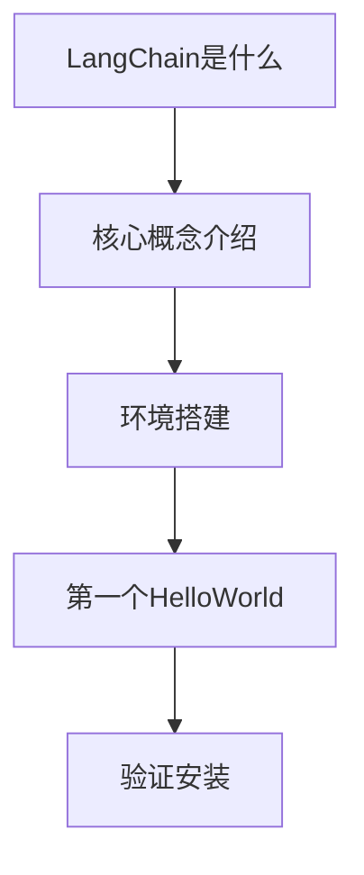
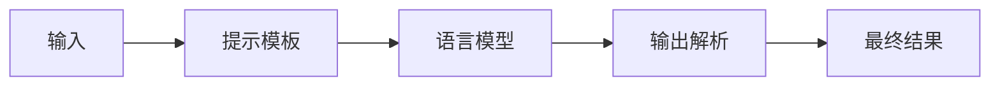
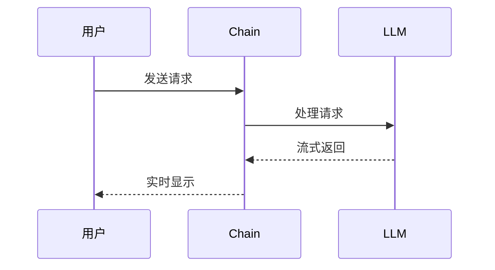
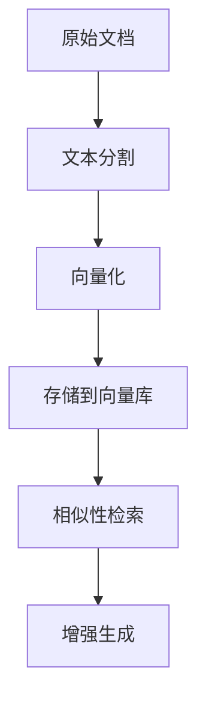
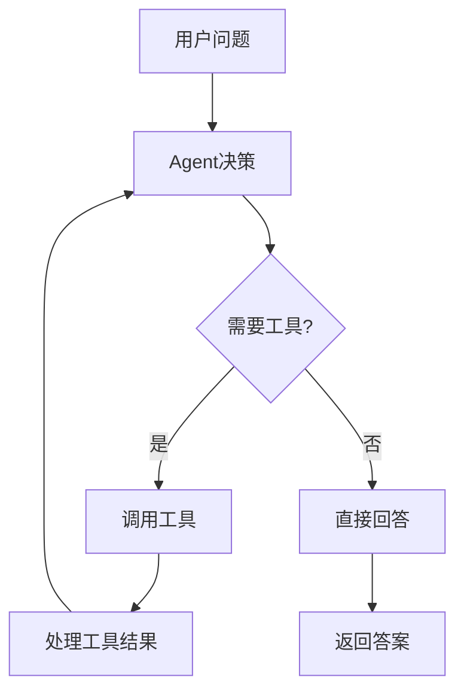
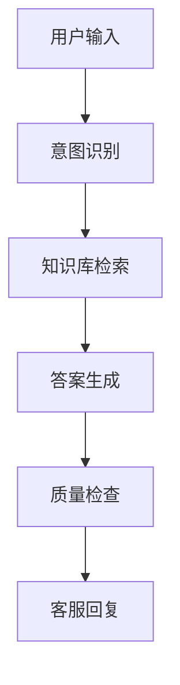

# LangChain 入门到精通知识文档设计

## 概述

本设计文档规划了一套完整的 LangChain 学习路径，从零基础小白到精通应用的系统性教程。教程将在 `langchain/proficient` 目录下创建，采用循序渐进的方式，每个小节配备详细的代码实例和通俗易懂的讲解。

## 目标用户

- LangChain 零基础小白用户
- 希望系统学习 AI 应用开发的开发者
- 需要构建智能应用的工程师

## 技术栈

基于项目现有技术栈：

- **Python 3.x**：主要编程语言
- **LangChain**：核心框架
- **ChatOpenAI**：多模型接口
- **支持的 LLM**：DeepSeek、Qwen 等
- **向量数据库**：FAISS
- **嵌入模型**：SiliconFlow Embeddings

## 文档结构设计

### 第一部分：基础入门（1-5 节）

#### 1. LangChain 简介与环境搭建

**文件名**：`1.langchain-introduction.py`

**内容架构**：



**核心知识点**：

- LangChain 框架概念和优势
- 安装依赖包（langchain-openai、langchain-core 等）
- 环境变量配置
- 基础的 Hello World 示例

**代码示例结构**：

```python
# 基础导入和环境检查
import os
import getpass
from langchain_openai import ChatOpenAI

# 简单的模型调用示例
# 环境变量配置示例
# 错误处理和调试
```

#### 2. 理解链式调用（LCEL）

**文件名**：`2.chain-basics.py`

**内容架构**：



**核心知识点**：

- LCEL（LangChain Expression Language）概念
- 管道操作符 `|` 的使用
- 链式调用的执行流程
- 数据在链中的传递机制

#### 3. 提示模板进阶

**文件名**：`3.prompt-templates.py`

**核心知识点**：

- ChatPromptTemplate 详解
- 系统消息和用户消息
- 变量注入机制
- 复杂提示模板构建

#### 4. 多模型接入与切换

**文件名**：`4.multi-model-integration.py`

**核心知识点**：

- DeepSeek API 集成
- SiliconFlow API 集成
- 模型参数配置
- 动态模型切换

#### 5. 输出解析与格式化

**文件名**：`5.output-parsing.py`

**核心知识点**：

- StrOutputParser 使用
- JSON 输出解析
- 结构化数据输出
- 自定义解析器

### 第二部分：中级应用（6-10 节）

#### 6. 流式输出与实时交互

**文件名**：`6.streaming-output.py`

**内容架构**：



**核心知识点**：

- 流式输出原理
- astream 方法使用
- 实时响应处理
- 用户体验优化

#### 7. 内存与上下文管理

**文件名**：`7.memory-management.py`

**核心知识点**：

- ConversationBufferMemory
- 会话历史管理
- 上下文窗口控制
- 多轮对话实现

#### 8. Runnable 接口深入

**文件名**：`8.runnable-interface.py`

**核心知识点**：

- Runnable 基类理解
- 自定义 Runnable 组件
- 组件组合与复用
- 异步执行模式

#### 9. 文档处理与 RAG 基础

**文件名**：`9.document-processing.py`

**内容架构**：



**核心知识点**：

- 文档加载与预处理
- RecursiveCharacterTextSplitter
- 文本块大小和重叠策略
- Document 对象操作

#### 10. 向量存储与检索

**文件名**：`10.vector-storage.py`

**核心知识点**：

- FAISS 向量数据库
- SiliconFlow 嵌入模型
- 相似性搜索算法
- MMR 检索策略

### 第三部分：高级特性（11-15 节）

#### 11. Agent 智能体入门

**文件名**：`11.agent-basics.py`

**内容架构**：



**核心知识点**：

- Agent 概念和工作原理
- ReAct 框架理解
- 工具定义与使用
- 决策循环机制

#### 12. 自定义工具开发

**文件名**：`12.custom-tools.py`

**核心知识点**：

- Tool 装饰器使用
- 工具参数定义
- 异常处理和错误恢复
- 工具组合使用

#### 13. 复杂 RAG 系统构建

**文件名**：`13.advanced-rag.py`

**核心知识点**：

- 多数据源集成
- 查询重写和扩展
- 结果重排序
- 答案质量评估

#### 14. 并发与性能优化

**文件名**：`14.performance-optimization.py`

**核心知识点**：

- 异步编程模式
- 批量处理优化
- 缓存策略
- 性能监控

#### 15. 生产环境部署

**文件名**：`15.production-deployment.py`

**核心知识点**：

- 环境配置管理
- 安全性最佳实践
- 监控和日志
- 错误处理机制

### 第四部分：实战项目（16-20 节）

#### 16. 智能客服系统

**文件名**：`16.customer-service-bot.py`

**项目架构**：



#### 17. 文档智能问答

**文件名**：`17.document-qa-system.py`

#### 18. 代码助手开发

**文件名**：`18.code-assistant.py`

#### 19. 多模态应用

**文件名**：`19.multimodal-application.py`

#### 20. 企业级 AI 工作流

**文件名**：`20.enterprise-workflow.py`

## 教学方法设计

### 1. 渐进式学习

- 每节课都基于前一节的知识
- 复杂概念分解为简单步骤
- 提供完整可运行的代码示例

### 2. 实践驱动

- 每个概念都配备实际代码
- 鼓励动手实验和修改
- 提供调试和排错指导

### 3. 可视化辅助

- 使用流程图展示执行过程
- Mermaid 图表说明架构关系
- 时序图展示交互流程

### 4. 通俗易懂

- 避免过度技术术语
- 使用生活化比喻解释概念
- 提供丰富的注释说明

## 代码示例规范

### 文件结构标准

```python
"""
第X节：[标题]
学习目标：[具体目标]
前置知识：[需要的基础]
"""

# 1. 必要的导入
import os
import getpass
from langchain_xxx import Xxx

# 2. 环境配置
# 详细的环境变量设置说明

# 3. 核心代码实现
# 带详细注释的主要功能

# 4. 示例使用
if __name__ == "__main__":
    # 完整的运行示例
    # 预期输出说明

# 5. 扩展练习
# 建议的改进方向
# 相关资源链接
```

### 注释风格

- 每个重要概念都有详细中文注释
- 代码块前后都有说明文字
- 参数含义和取值范围明确标注
- 常见错误和解决方案提示

## 学习路径指导

### 初学者路径（1-5 节）

适合完全没有 LangChain 经验的用户：

1. 建议每天学习 1 节，共 5 天完成
2. 每节学习后完成练习作业
3. 遇到问题查看调试指南

### 进阶路径（6-10 节）

适合有基础概念的开发者：

1. 可以 2 节合并学习
2. 重点关注实际项目应用
3. 尝试修改示例代码

### 专家路径（11-20 节）

适合希望深入掌握的工程师：

1. 可以跳跃式学习感兴趣的部分
2. 重点关注生产环境考虑
3. 参与开源项目贡献

## 质量保证机制

### 代码质量

- 所有代码经过实际运行测试
- 兼容项目现有技术栈
- 遵循 Python 代码规范
- 包含错误处理机制

### 内容质量

- 概念解释准确无误
- 示例贴近实际应用
- 难度曲线合理
- 学习目标明确

### 持续改进

- 收集用户反馈
- 定期更新内容
- 跟进 LangChain 版本更新
- 补充新的应用场景

## 预期学习效果

### 入门阶段（完成 1-5 节）

学习者能够：

- 理解 LangChain 核心概念
- 独立搭建开发环境
- 编写简单的 AI 应用
- 调试基础问题

### 中级阶段（完成 6-10 节）

学习者能够：

- 构建复杂的处理链
- 实现 RAG 应用
- 管理对话状态
- 优化应用性能

### 高级阶段（完成 11-15 节）

学习者能够：

- 开发智能 Agent
- 创建自定义工具
- 设计生产级系统
- 解决复杂技术问题

### 实战阶段（完成 16-20 节）

学习者能够：

- 独立完成企业级项目
- 架构复杂 AI 系统
- 指导团队开发
- 贡献开源社区

## 技术要求

### 开发环境

- Python 3.8+
- 支持 Jupyter Notebook（可选）
- 网络访问（API 调用）
- 至少 4GB 内存

### 依赖管理

基于现有项目结构，主要依赖：

```text
langchain-openai
langchain-core
langchain-community
langchain-text-splitters
langchain-siliconflow
python-dotenv
pydantic
faiss-cpu
```

### API 密钥要求

- DeepSeek API Key（用于基础模型调用）
- SiliconFlow API Key（用于嵌入和高级模型）
- 其他第三方服务密钥（根据具体应用）

这套教程设计将为小白用户提供一个完整、系统、实用的 LangChain 学习路径，确保每个学习者都能从零基础成长为 LangChain 应用专家。
