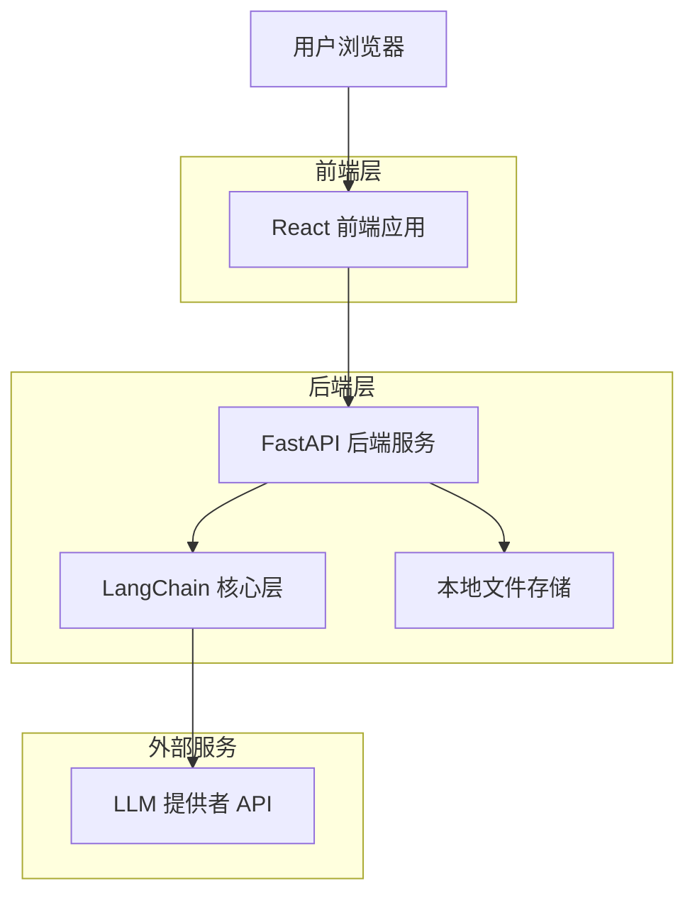
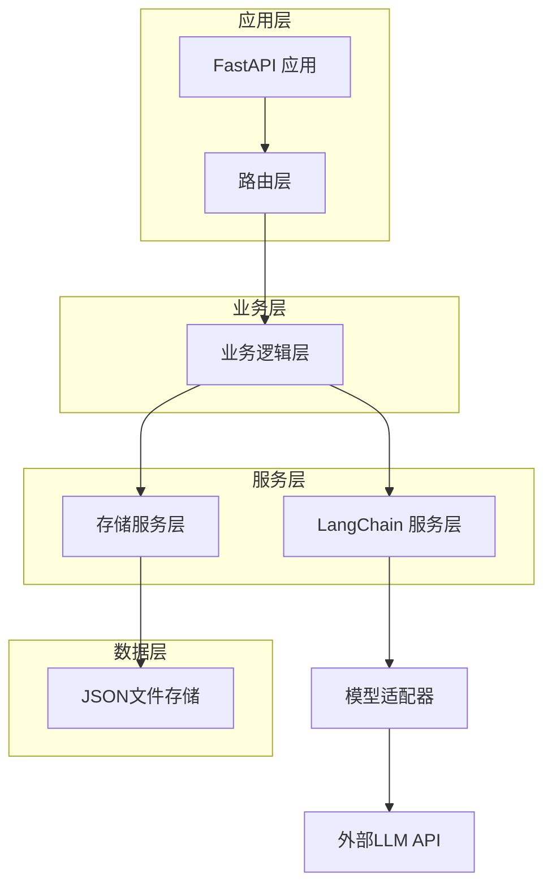
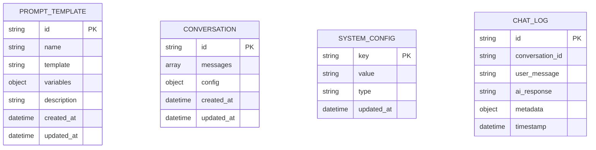

# LangChain 知识库助手第一期技术架构文档

## 1. 架构设计



## 2. 技术描述

- 前端：React@18 + TypeScript + Tailwind CSS + Vite
- 后端：FastAPI + Python 3.10 + LangChain + Pydantic
- 存储：本地JSON文件（Prompt模板、配置、日志）
- LLM集成：支持OpenAI、Anthropic、HuggingFace等多提供者

## 3. 路由定义

| 路由 | 用途 |
|------|------|
| / | 聊天界面主页 |
| /admin | 管理后台首页 |
| /admin/prompts | Prompt模板管理页面 |
| /admin/config | 系统配置页面 |
| /admin/logs | 日志查看页面 |

## 4. API定义

### 4.1 核心API

**聊天对话接口**
```
POST /api/chat
```

请求参数：
| 参数名 | 参数类型 | 是否必需 | 描述 |
|--------|----------|----------|------|
| message | string | true | 用户输入消息 |
| system_prompt | string | false | 系统提示词模板ID |
| temperature | float | false | 温度参数(0.0-1.0) |
| conversation_id | string | false | 会话ID |

响应参数：
| 参数名 | 参数类型 | 描述 |
|--------|----------|------|
| response | string | AI回复内容 |
| conversation_id | string | 会话ID |
| timestamp | string | 响应时间戳 |
| model_info | object | 使用的模型信息 |

请求示例：
```json
{
  "message": "你好，请介绍一下LangChain",
  "system_prompt": "helpful_assistant",
  "temperature": 0.7
}
```

响应示例：
```json
{
  "response": "你好！LangChain是一个用于构建基于大语言模型应用的框架...",
  "conversation_id": "conv_123456",
  "timestamp": "2024-01-15T10:30:00Z",
  "model_info": {
    "provider": "openai",
    "model": "gpt-3.5-turbo",
    "tokens_used": 150
  }
}
```

**Prompt模板管理**
```
GET /api/prompts
POST /api/prompts
PUT /api/prompts/{prompt_id}
DELETE /api/prompts/{prompt_id}
```

**系统配置**
```
GET /api/config
PUT /api/config
```

**日志查询**
```
GET /api/logs
```

## 5. 服务器架构图



## 6. 数据模型

### 6.1 数据模型定义



### 6.2 数据定义语言

**Prompt模板存储 (prompts.json)**
```json
{
  "helpful_assistant": {
    "id": "helpful_assistant",
    "name": "友好助手",
    "template": "你是一个友好、专业的AI助手。请用{tone}的语气回答用户问题。",
    "variables": ["tone"],
    "description": "通用友好助手模板",
    "created_at": "2024-01-15T10:00:00Z",
    "updated_at": "2024-01-15T10:00:00Z"
  },
  "technical_expert": {
    "id": "technical_expert",
    "name": "技术专家",
    "template": "你是一个{domain}领域的技术专家。请提供准确、详细的技术解答。",
    "variables": ["domain"],
    "description": "技术领域专家模板",
    "created_at": "2024-01-15T10:00:00Z",
    "updated_at": "2024-01-15T10:00:00Z"
  },
  "creative_writer": {
    "id": "creative_writer",
    "name": "创意写手",
    "template": "你是一个富有创意的写手。请用{style}的风格创作内容。",
    "variables": ["style"],
    "description": "创意写作模板",
    "created_at": "2024-01-15T10:00:00Z",
    "updated_at": "2024-01-15T10:00:00Z"
  }
}
```

**系统配置存储 (config.json)**
```json
{
  "llm_provider": {
    "key": "llm_provider",
    "value": "openai",
    "type": "string",
    "updated_at": "2024-01-15T10:00:00Z"
  },
  "openai_api_key": {
    "key": "openai_api_key",
    "value": "sk-...",
    "type": "secret",
    "updated_at": "2024-01-15T10:00:00Z"
  },
  "default_model": {
    "key": "default_model",
    "value": "gpt-3.5-turbo",
    "type": "string",
    "updated_at": "2024-01-15T10:00:00Z"
  },
  "default_temperature": {
    "key": "default_temperature",
    "value": "0.7",
    "type": "float",
    "updated_at": "2024-01-15T10:00:00Z"
  }
}
```

**对话日志存储 (logs/{date}.json)**
```json
[
  {
    "id": "log_123456",
    "conversation_id": "conv_123456",
    "user_message": "你好，请介绍一下LangChain",
    "ai_response": "你好！LangChain是一个用于构建基于大语言模型应用的框架...",
    "metadata": {
      "model": "gpt-3.5-turbo",
      "temperature": 0.7,
      "prompt_template": "helpful_assistant",
      "tokens_used": 150,
      "response_time_ms": 1200
    },
    "timestamp": "2024-01-15T10:30:00Z"
  }
]
```