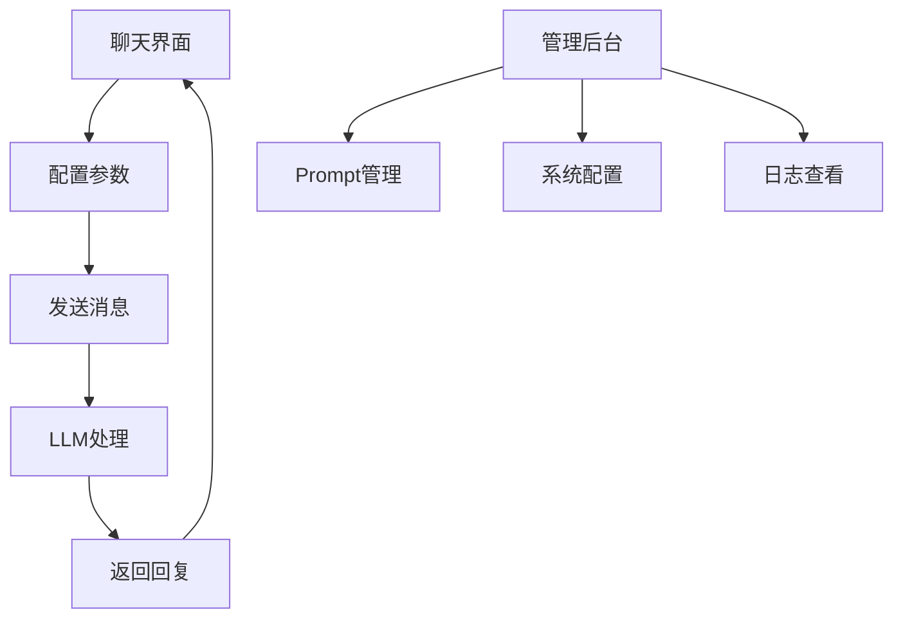

# LangChain 知识库助手第一期产品需求文档

## 1. 产品概述

本项目第一期旨在构建一个基础的LLM聊天助手PoC，验证LLM接入、Prompt管理与基本回复质量。这是企业级知识中心+智能助理平台的第一个里程碑，为后续RAG、Agent等高级功能奠定基础。

目标是快速验证技术可行性，建立统一的LLM调用接口和Prompt管理机制，为企业用户提供基础的智能对话服务。

## 2. 核心功能

### 2.1 用户角色

第一期不区分用户角色，所有用户均可使用基础聊天功能。

### 2.2 功能模块

本期需求包含以下核心页面：
1. **聊天界面**：用户输入、消息展示、配置面板
2. **管理后台**：Prompt模板管理、系统配置

### 2.3 页面详情

| 页面名称 | 模块名称 | 功能描述 |
|---------|---------|----------|
| 聊天界面 | 消息输入区 | 支持用户输入文本消息，发送按钮，输入历史 |
| 聊天界面 | 对话展示区 | 显示用户和AI的对话历史，支持滚动查看 |
| 聊天界面 | 配置面板 | 调整temperature参数、选择系统prompt模板 |
| 管理后台 | Prompt模板库 | 创建、编辑、删除Prompt模板，支持参数化 |
| 管理后台 | 系统配置 | LLM提供者配置、API密钥管理、日志设置 |
| 管理后台 | 日志查看 | 查看请求/响应日志，包括messages格式化记录 |

## 3. 核心流程

用户操作流程：
1. 用户访问聊天界面
2. 选择或使用默认系统prompt模板
3. 调整temperature等参数（可选）
4. 输入消息并发送
5. 系统调用LLM生成回复
6. 显示AI回复，记录完整对话日志

管理员流程：
1. 访问管理后台
2. 配置LLM提供者和API密钥
3. 创建和管理Prompt模板
4. 查看系统日志和对话记录

## 4. 用户界面设计

### 4.1 设计风格

- 主色调：蓝色系（#2563eb）和灰色系（#64748b）
- 按钮样式：圆角按钮，悬停效果
- 字体：系统默认字体，正文14px，标题16-20px
- 布局风格：简洁的卡片式布局，左侧导航
- 图标风格：简约线性图标

### 4.2 页面设计概览

| 页面名称 | 模块名称 | UI元素 |
|---------|---------|--------|
| 聊天界面 | 消息输入区 | 文本输入框，发送按钮（蓝色），字符计数 |
| 聊天界面 | 对话展示区 | 消息气泡（用户：右侧蓝色，AI：左侧灰色），时间戳 |
| 聊天界面 | 配置面板 | 滑块控件（temperature），下拉选择（prompt模板） |
| 管理后台 | Prompt模板库 | 表格展示，新增/编辑按钮，模态对话框 |
| 管理后台 | 系统配置 | 表单布局，输入框，保存按钮 |
| 管理后台 | 日志查看 | 表格展示，搜索过滤，分页控件 |

### 4.3 响应式设计

采用桌面优先设计，支持移动端自适应。聊天界面针对触屏操作优化，按钮大小适合手指点击。