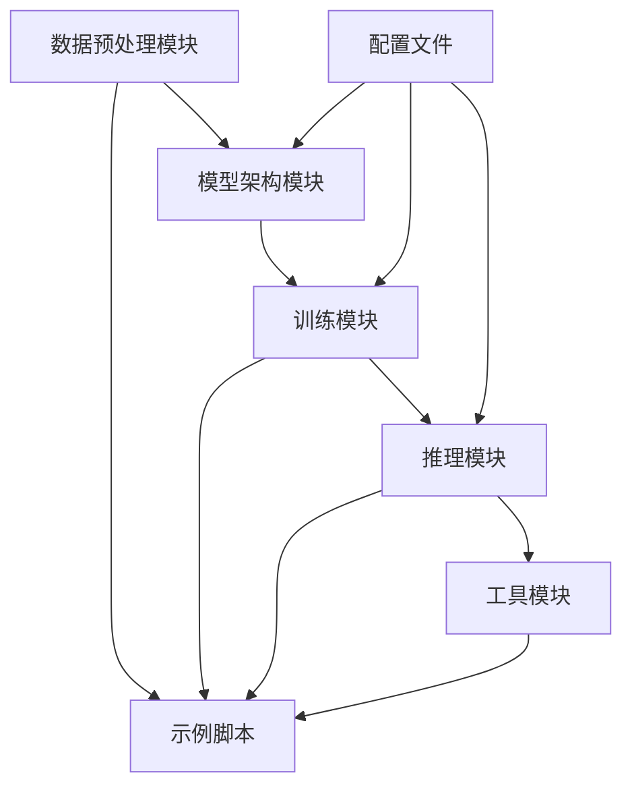

# Transformer 中英翻译 Demo 项目需求文档

## 1. 产品概述

本项目是一个基于 Transformer 架构的中英文机器翻译演示系统，旨在展示深度学习在自然语言处理领域的应用。
- 项目将实现完整的 Transformer 模型架构，包括编码器-解码器结构，用于中英文双向翻译任务。
- 面向机器学习研究者、学生和开发者，提供可学习和可扩展的翻译模型实现。
- 通过详细的中文注释和模块化设计，帮助用户理解 Transformer 模型的工作原理和实现细节。

## 2. 核心功能

### 2.1 用户角色

| 角色 | 使用方式 | 核心权限 |
|------|----------|----------|
| 研究者/开发者 | 直接运行代码 | 可训练模型、调整参数、查看训练过程 |
| 学习者 | 阅读代码和文档 | 可运行预训练模型进行翻译测试 |

### 2.2 功能模块

项目包含以下核心页面和模块：
1. **数据预处理模块**：中英文文本清洗、分词、词汇表构建
2. **模型架构模块**：Transformer 编码器、解码器、注意力机制实现
3. **训练模块**：模型训练、验证、损失计算和优化
4. **推理模块**：单句翻译、批量翻译、模型评估
5. **工具模块**：数据加载、模型保存/加载、可视化工具
6. **示例脚本**：完整的训练和推理示例
7. **配置文件**：模型参数、训练超参数配置

### 2.3 页面详情

| 页面名称 | 模块名称 | 功能描述 |
|----------|----------|----------|
| 数据预处理模块 | 文本清洗 | 清理原始文本数据，去除特殊字符，标准化格式 |
| 数据预处理模块 | 分词处理 | 中英文分词，构建词汇表，文本序列化 |
| 数据预处理模块 | 数据加载器 | 批量数据加载，数据增强，训练/验证集划分 |
| 模型架构模块 | 多头注意力 | 实现多头自注意力和交叉注意力机制 |
| 模型架构模块 | 位置编码 | 正弦余弦位置编码，支持可学习位置嵌入 |
| 模型架构模块 | 编码器层 | Transformer 编码器层，包含注意力和前馈网络 |
| 模型架构模块 | 解码器层 | Transformer 解码器层，支持掩码注意力 |
| 训练模块 | 损失计算 | 交叉熵损失，标签平滑，梯度裁剪 |
| 训练模块 | 优化器配置 | Adam 优化器，学习率调度，权重衰减 |
| 训练模块 | 训练循环 | 完整训练流程，验证评估，模型检查点保存 |
| 推理模块 | 单句翻译 | 输入单个句子进行翻译，支持束搜索解码 |
| 推理模块 | 批量翻译 | 批量处理多个句子，提高推理效率 |
| 推理模块 | 模型评估 | BLEU 分数计算，翻译质量评估 |
| 工具模块 | 可视化工具 | 注意力权重可视化，训练曲线绘制 |
| 工具模块 | 模型管理 | 模型保存/加载，参数统计，模型压缩 |

## 3. 核心流程

**主要操作流程：**

1. **数据准备流程**：加载原始中英文平行语料 → 文本清洗和预处理 → 分词和词汇表构建 → 序列化和批处理

2. **模型训练流程**：初始化 Transformer 模型 → 配置优化器和损失函数 → 训练循环（前向传播、损失计算、反向传播） → 验证评估 → 保存最佳模型

3. **模型推理流程**：加载预训练模型 → 输入文本预处理 → 模型推理和解码 → 后处理和输出翻译结果

## 4. 用户界面设计

### 4.1 设计风格

- **主色调**：深蓝色 (#2C3E50) 和浅蓝色 (#3498DB)
- **辅助色**：绿色 (#27AE60) 用于成功状态，红色 (#E74C3C) 用于错误提示
- **代码风格**：使用 Python 标准代码规范，函数和类名采用下划线命名
- **字体**：代码使用等宽字体，注释使用中文宋体
- **布局风格**：模块化设计，每个功能独立文件，清晰的目录结构
- **图标风格**：使用 matplotlib 进行数据可视化，简洁的线条图和热力图

### 4.2 页面设计概览

| 页面名称 | 模块名称 | UI 元素 |
|----------|----------|----------|
| 数据预处理模块 | 文本处理 | 命令行输出，进度条显示，数据统计表格 |
| 模型架构模块 | 网络结构 | 模型结构图，参数统计，层级可视化 |
| 训练模块 | 训练界面 | 训练日志输出，损失曲线图，验证指标表 |
| 推理模块 | 翻译界面 | 输入文本框，翻译结果显示，置信度分数 |
| 工具模块 | 可视化 | 注意力热力图，词汇分布图，模型性能图表 |

### 4.3 响应性

本项目主要为桌面端 Python 应用，支持命令行和 Jupyter Notebook 两种运行方式，不涉及移动端适配。重点关注代码的可读性和模块化设计。